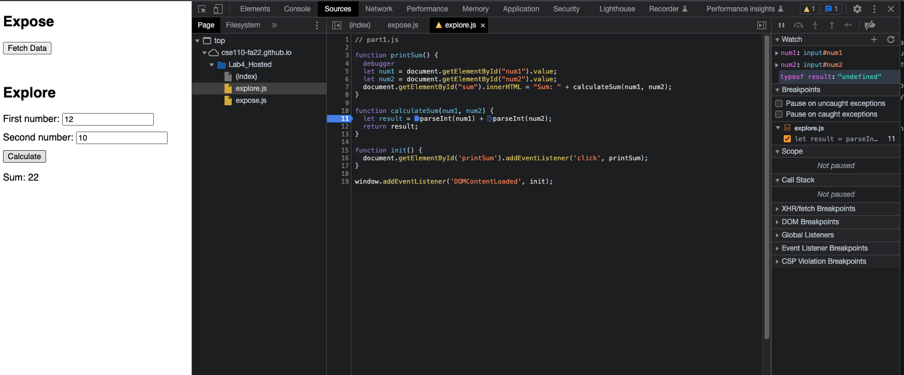

# DevTools - Debugging

1. What was the bug?
   
   The `+` operation is used for concatenation because `num1` and `num2` are strings. To `+` operation is used for addition, `num1` and `num2` need to map to numbers.

2. How would you fix it? Include a screenshot of your fix. Name it fix.png (or whatever image extension you would like to use)
   
   - To fix this problem, I used the `parseInt()` to map *num1* and *num2* to numbers.
  
        

        

